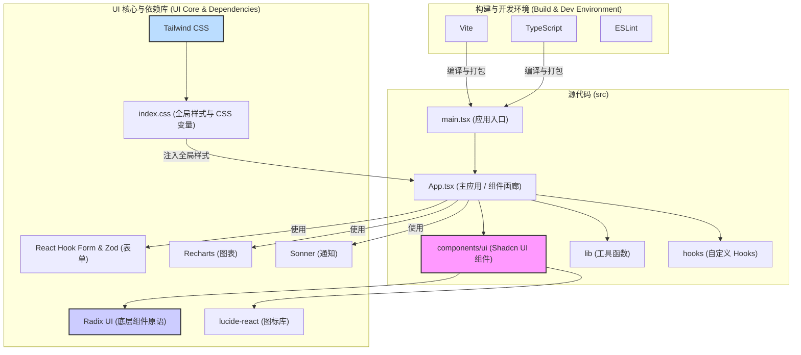

# 项目架构图

这是一个使用 Mermaid 绘制的项目架构图，展示了项目的核心组件和它们之间的相互关系。

**图表解读:**

1.  **构建与开发环境**: 项目的根基是 Vite、TypeScript 和 ESLint，它们共同保证了开发的效率和代码的质量。
2.  **源代码**:
    *   `main.tsx` 是整个应用的入口文件。
    *   `App.tsx` 是当前的核心组件，它作为一个“组件画廊”，集中展示和测试了项目中所有的 UI 组件。
    *   `components/ui` 目录是 `shadcn/ui` 组件的所在地，是 UI 的核心。
    *   `lib` 和 `hooks` 提供了可复用的逻辑和功能。
3.  **UI 核心与依赖库**:
    *   `shadcn/ui` 组件（F）构建在 `Radix UI`（I）之上，并使用 `lucide-react`（J）作为图标。
    *   `Tailwind CSS`（K）通过处理 `index.css`（L）为整个应用提供样式。
    *   应用（E）直接使用了如表单、图表和通知等库（M, N, O）来构建复杂功能。

架构图已绘制完成。接下来，我将分析项目的核心功能和代码结构。